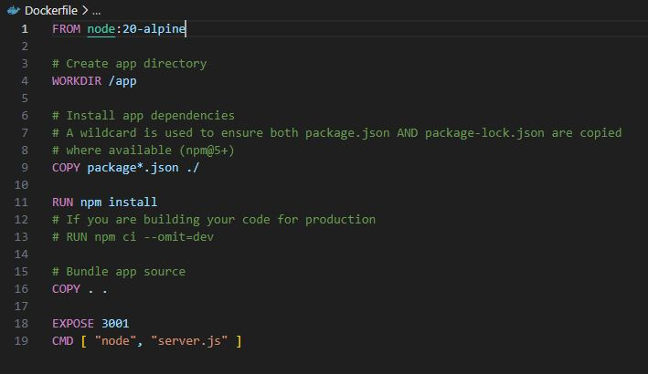
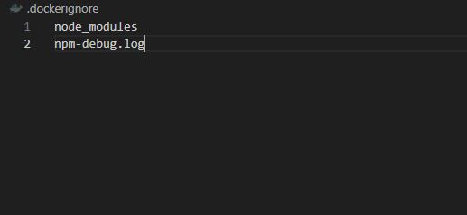
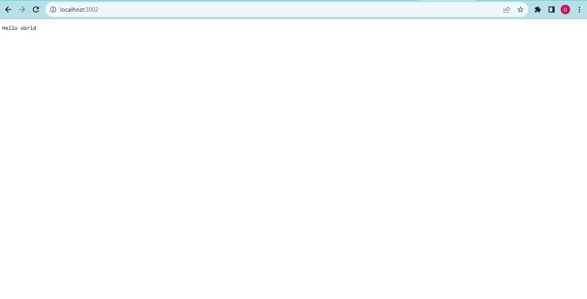

<h3 align="center">
Hi there, I'm Deffi 👋
</h3>

### 🤝 Connect with me:

[Linkedin](https://www.linkedin.com/in/defficharlinasari/)
[Instagram](https://www.instagram.com/defficharlina/)
- 💬 If you have any question/feedback, please do not hesitate to reach out to me!

# Project Description
This project is about simple node.js project can be run inside docker container

## Skill
1. Docker

    Docker is a platform designed to help developers build, share, and run modern applications. We handle the tedious setup, so you can focus on the code.

## Dev Environment Setup
1. Docker

    Install Docker, please visit [Docker](https://www.docker.com/)

2. Git Bash

    For installation, please visit [Git Bash](https://git-scm.com/downloads)

3. Visual Studio Code

    For installation, please visit [Visual Studio Code](https://code.visualstudio.com/)

## Installing Docker and WSL
1. Click Download Docker Dekstop Windows

  

    
  

2. Install Docker

  

    
  

3. You can install WSL or update WSL

  

    
  

## Create files 
1. Clone repo https://github.com/RevoU-FSSE-2/week-6-defficharlina
2. Download simple Node.js project from https://gist.github.com/berdoezt/e51718982926f0caa3fcd8ed45111430 and save with
   name server.js in Visual Studio Code

   

    
   

3. Create file package.json

   

    
   

4. Create Dockerfile

   

    
   

5. Create .dockerignore

   

    
   

## Build and run image
1. Build image with terminal and using command **docker build . -t your_image_name**
2. Check our image using command **docker images**

   

    
   

3. We can check our image in docker dekstop

   

    
   

4. And then run the image using command **docker run -p your-localport:app-port your_image_name**

   

    
   

5. Let's check the result on localhost

   

    
   

## The last step's push to Github all files that we created and finished
